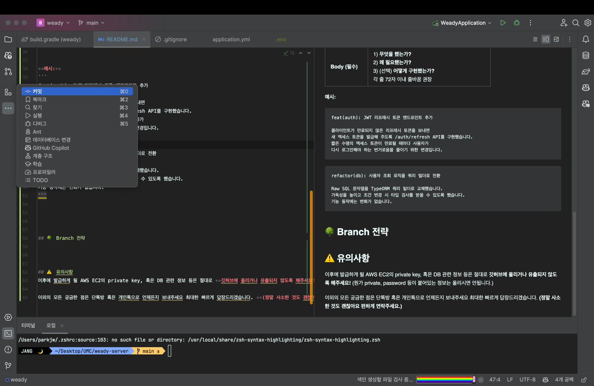
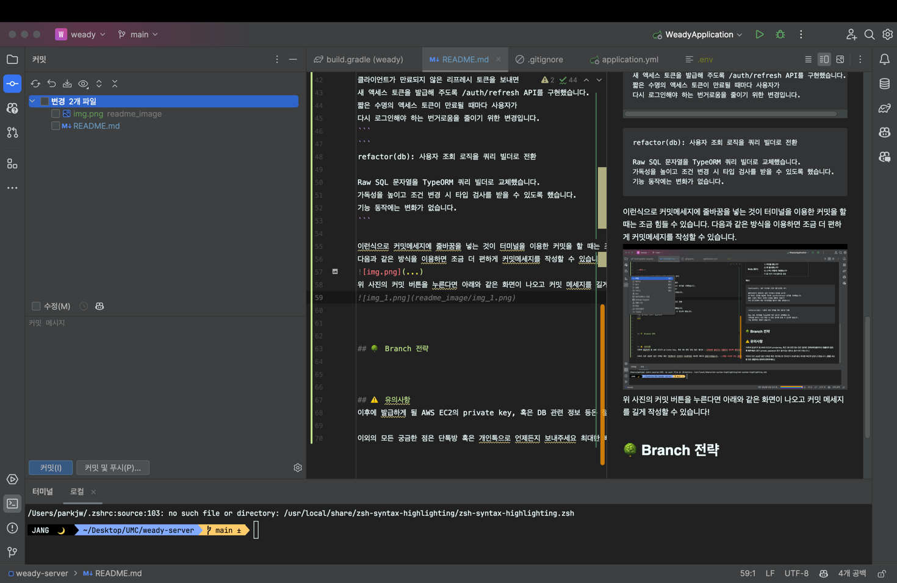

# Weady Server
### 안녕하세요 웨디 백엔드 개발자 여러분
해당 문서에서는 커밋 컨벤션, PR-Branch 전략, 유의사항 등을 다루겠습니다.

<br>

---

<br>

## ✍️ 커밋 컨벤션
**커밋을 할 때의 메세지는 다음의 규칙을 따라주세요!**  
조금 귀찮을 순 있어도 원할한 협업을 위해 꼭 지켜주세요.   
(언젠간 배우시게 될 부분이어서 연습을 위해 규칙을 정합니다!)

| `type`     | 용도                        |
| ---------- |---------------------------|
| `feat`     | 새로운 기능                    |
| `fix`      | 버그 수정                     |
| `docs`     | 문서 변경                     |
| `style`    | 포맷팅, 세미콜론 등 코드동작과 관련없는 변경 |
| `refactor` | 리팩터링                      |
| `perf`     | 성능 개선                     |
| `test`     | 테스트 코드 추가·수정              |
| `build`    | 빌드/패키지 매니저 설정             |
| `ci`       | CI 설정·스크립트                |
| `chore`    | 기타 잡무(린터 설정 등)            |
| `revert`   | 이전 커밋 되돌리기                |

<br>

| 파트              | 규칙                                                                                   |
|-----------------|--------------------------------------------------------------------------------------|
| **Header (필수)** | `type`, `subject`로 구성.<br>`subject`는 명령형 현재시제, 50자 이내, 마침표 ❌ <br> <br> 예시) `feat: JWT 리프레시 토큰 엔드포인트 추가`|

**예시:**
```
feat(auth): JWT 리프레시 토큰 엔드포인트 추가
```
```
refactor(db): 사용자 조회 로직을 쿼리 빌더로 전환
```

예시와 같이 커밋메세지를 입력해주시면 됩니다.
다음과 같은 방식을 이용하면 조금 더 편하게 커밋메세지를 작성할 수 있습니다.



위 사진의 커밋 버튼을 누르면 아래와 같이 좌측 하단에 커밋메세지를 입력하는 칸이 나오고
예시와 같이 커밋 메세지를 작성할 수 있습니다!
(당연히 add를 통해 변경된 파일을 stage에 올린 후에 해주셔야합니다)



## 🌳 Branch 전략
**Branch 전략은 다음과 같습니다**

| 브랜치                       | 역할         | 머지 방식                       |
| ------------------------- | ---------- | --------------------------- |
| `main`                    | 배포·프로덕션용   | **PR + Squash merge** 만 허용  |
| `dev`                     | 통합 개발      | PR → 자동 테스트 통과 후 `main`에 PR |
| `feature/<issue-번호>-<설명>` | 단일 기능 구현   | 완료되면 `dev`에 PR              |
| `bugfix/<issue-번호>-<설명>`  | 버그 핫픽스     | 긴급일 경우 바로 `main`에 PR        |
| `hotfix/<yyyyMMdd>-<설명>`  | 배포 후 긴급 수정 | 병합 즉시 새 패치 릴리스              |
| `release/<버전>` (선택)       | 릴리스 준비     | 릴리스 노트·버전 태깅 전용             |

예시) feature/101-invite-friends

### 작업 흐름
1. 이슈 생성 
   - GitHub 이슈를 통해 작업할 기능이나 버그를 정의합니다.
   - 이슈 번호는 브랜치 이름에 포함됩니다.
2. 브랜치 생성
   - `dev` 브랜치에서 새로운 기능이나 버그 수정 작업을 위해 브랜치를 생성합니다.
   - 브랜치 이름은 `feature/<issue-번호>-<설명>` 또는 `bugfix/<issue-번호>-<설명>` 형식으로 지정합니다.
   - 로컬에서 다음과 같이 브랜치를 생성할 수 있습니다.
   ```bash
    git checkout dev               # 통합 브랜치 기준
    git pull origin dev            # 최신화
    git checkout -b feature/101-invite-friends # 브랜치 명은 예시
    git push -u origin HEAD        # 원격 브랜치 동시 생성
   ```
3. 작업 및 커밋
4. PR 생성
   - 작업이 완료되면 `dev` 브랜치로 PR을 생성합니다.
   - PR 제목은 `feat: <기능 설명>` 또는 `fix: <버그 설명>` 형식으로 작성합니다.
   - PR 설명에는 변경 사항, 이유 등을 상세히 작성합니다.
5. 코드 리뷰
   - 팀원들이 PR을 리뷰하고 피드백을 제공합니다.
   - 필요한 경우 수정 후 다시 커밋합니다.
6. 머지


## ⚠️ 유의사항
이후에 발급하게 될 AWS EC2의 private key, 혹은 DB 관련 정보 등은 절대로 **깃허브에 올리거나 유출되지 않도록 해주세요!** (뭔가 private, password 등이 붙어있는 정보는 올리시면 안됩니다.)  

❗️**수정)** github의 서브모듈 기능을 이용해서 private repository를 하나 만들고 현재 레포지토리와 연결할 예정입니다. private repository 에는 위의 정보들 올리셔도 됩니다! 해당 설정 완료되고나면 다시 말씀 드리겠습니다.

<br>

이외의 모든 궁금한 점은 단톡방 혹은 개인톡으로 언제든지 보내주세요 최대한 빠르게 답장드리겠습니다. **(정말 사소한 것도 괜찮아요 편하게 연락주세요.)**

**추가적으로 `git push main --force`는 절대 사용하지 말아주세요ㅠㅠ**
